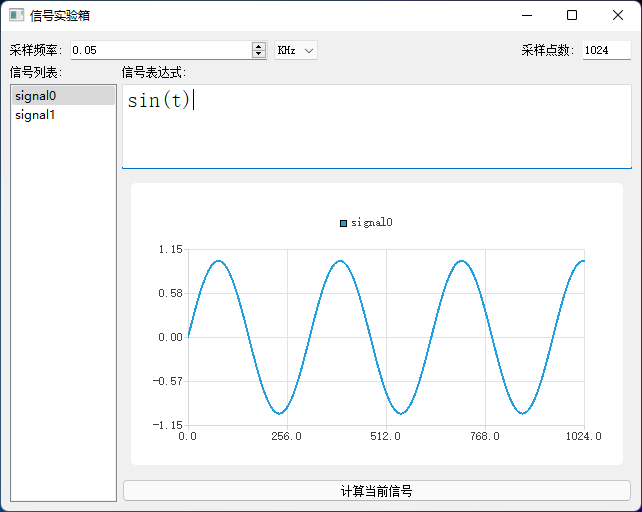
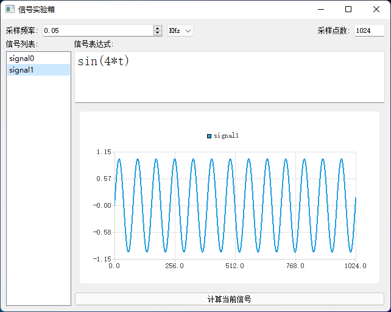
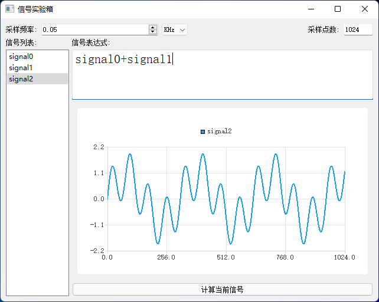
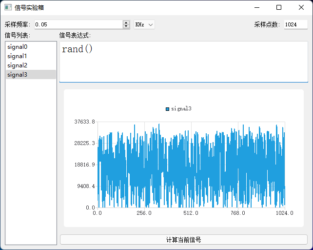
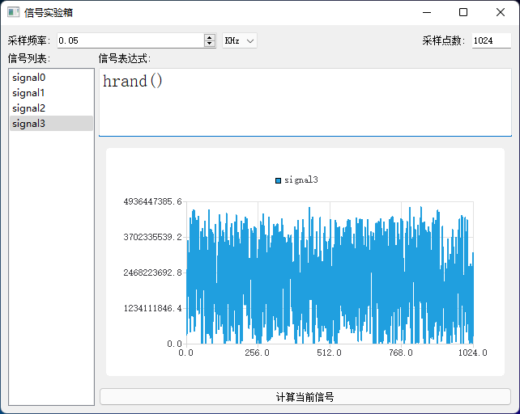
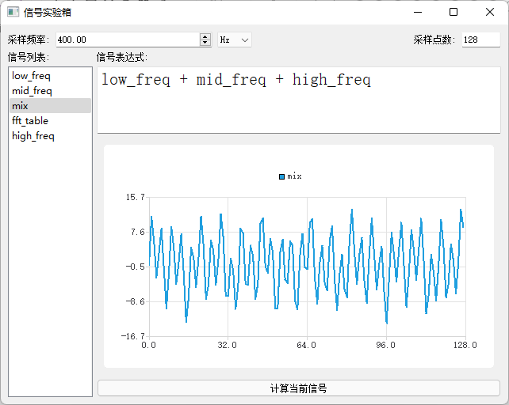
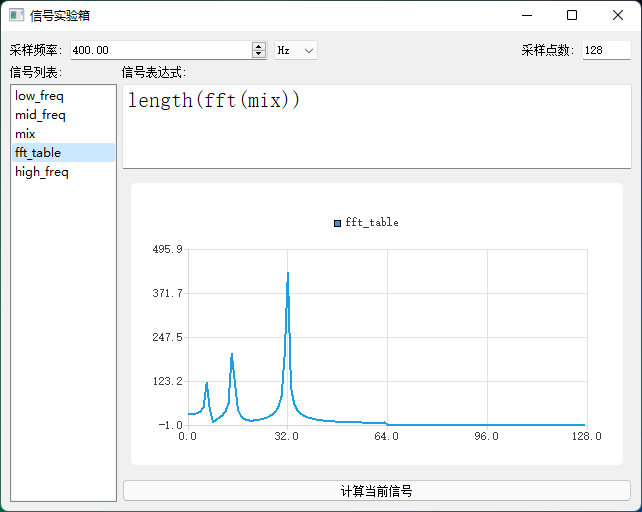

# 信号实验箱

本软件为一个基于表达式的信号计算、绘图软件,主要功能为对输入的信号进行采样,然后对采样序列进行各种运算,并将运算结果绘制为波形

如果你在使用、阅读源码、构建等方面有任何疑问,均可在仓库内提交`Issues`,我看到会处理

- [1. 简单示例](#1-简单示例)
- [2. 工作原理](#2-工作原理)
- [3. 信号定义](#3-信号定义)
- [4. 内置编译器](#4-内置编译器)
- [5. 函数库](#5-函数库)
- [6. 发行版](#6-发行版)
- [7. 构建源码](#7-构建源码)
  - [7.1. 推荐的方式](#71-推荐的方式)
  - [7.2. 手动方式](#72-手动方式)

## 1. 简单示例

输入信号表达式,设置采样率和采样点数即可看到波形

信号可以嵌套使用,方便拿两个信号做运算,最大可嵌套15层  

除正余弦以外,内置还有一些其他的函数可供使用,例如软件随机rand和硬件随机hrand  

傅立叶变换,对变换结果调用length是因为fft函数输出为复数,而length函数为向量求模函数,因此可求出幅度谱

## 2. 工作原理

1. 一个信号可用一个表达式 **f** 进行描述,在任意的 **t** 时刻,信号的强度为 **f(t)**
2. 若给定某时刻 **t** ,则表达式 **f(t)** 的运算结果即为信号 **f** 在 **t** 时刻的信号强度采样值
3. **t** 可根据软件内设置的采样频率计算得出,然后重复采样 **N** 次, **N** 为软件内设置的采样点数
4. 软件在计算前会将要计算的信号的表达式编译为语法树
5. 语法树内每个节点在计算自身的值之前,会先将子节点的值计算出来,因此根节点的计算值即为表达式整体的值
6. 然后重复计算根节点的值,便得到采样序列
7. 若自定义信号之间存在相互引用,则内层信号将会先运算得到运算值,然后再进行外层信号的运算
8. 信号存在最大嵌套层数限制,防止某信号引用自身或者多个信号交叉引用造成无限递归的情况

## 3. 信号定义

在软件内所有的信号定义均为表达式形式,例如`sin(t)`便是代表了经过数字采样的 **sin** 信号, 例如`sin(100*t) + sin(200*t)`便是将两个频率不同的信号叠加  

信号间可以相互引用,例如`sig0 = sin(100*t) sig1 = sin(200*t) sig2 = sig0+sig1`

信号自身引用自身或交叉引用均会触发最大嵌套限制

## 4. 内置编译器

软件内置一个简单的编译器,支持常用的数学表达式文法、双斜杠单行注释文法和 **if** 条件文法

编译器支持一个特殊变量 **t** ,代表当前的时间,也就是第 **n** 次采样除以采样频率 **fs**, `t = n/fs`

编译器支持一个常量 **pi** ,代表圆周率

编译器对于符号的处理和解析是大小写无关的,pi等价PI Pi pI,t也等价于T

## 5. 函数库

所有的函数均为外部函数库解析得到,函数库由两部分构成,第一部分是库描述文件,格式为`Json`,用于描述需要加载动态库文件里面的哪些符号,以及这些函数所需要的参数数量(用于编译时的参数检查)

目前软件内置了两个库, 即`basic`和`transform`,前者包括了常用的数学函数,后者目前只有`fft`这一个函数,具体的库内包括哪些文件你可以打开对应的json文件查看

同样的,如果你自己构建了动态库,并且编写了对应的json文件,你可以把他们放置在安装目录的lib子目录下,然后在信号表达式内调用即可

## 6. 发行版

为了避免使用者自行构建的麻烦,你可以在仓库右侧,`简介`的下方找到`发行版`一栏,在这里是编译并打包好的软件,可直接下载使用.但是请注意,只有较大版本更新之后才会发布发行版,因此你所下载到的发行版的功能可能是不如源码强的,如果要体验最新版软件请参考[7. 构建源码](#7-构建源码)自行构建最新版软件

## 7. 构建源码

本工程使用`CMake`作为顶层构建系统,`CMake`可产生多种下层构建系统所需文件,例如`Makefile`

除此之外,本工程的内置编译器并非纯手写完成,词法分析器和语法分析器基于`flex`/`bison`构建,因此在构建时需要用户的开发环境内有可用的`flex`和`bison`

### 7.1. 推荐的方式

本人使用vscode开发本工程,所使用到的工作区文件也在源码目录下,完整下载源码后双击[tiny-signal-box.code-workspace](./tiny-signal-box.code-workspace)文件即可自动打开vscode对代码进行编辑和浏览.工作区文件内包括了vscode的设置项,构建所用的task以及调试所需要的launch配置,因此无需使用者再次配置,只要你是通过工作区文件打开的工程,那么你所使用的配置就和我的是一样的

构建之前,请先安装`CMake`和`Ninja`,前者用于产生后者所需的文件,后者则负责执行文件中的规则,调用编译器编译和链接程序

除此之外,还需要安装`flex`和`bison`,推荐的方式是安装**虚拟的linux环境**,也就是`Cygwin`,在安装`Cygwin`时,选择`flex`和`bison`的软件包即可,在`Cygwin`安装完成后,将vscode的内置终端替换为`Cygwin`所使用的`bash.exe`

如果安装`Cygwin`时没有选择`flex`和`bison`,可以在安装完成后再次运行安装程序重新选择,实际上这并不会重新安装,只会把你对软件包的各种修改应用到已装好的`Cygwin`里

关于如何配置vscode的内置终端,请查看[Terminal profiles](https://code.visualstudio.com/docs/editor/integrated-terminal#_terminal-profiles)

如果要在vscode内构建,请安装`CMake Tools`扩展程序,安装好后再次打开工作区文件,vscode会在上方正中央弹出选择工具链的选择框,选择QT提供的工具链然后进行CMake配置,配置完成后源码目录下会出现build文件夹,然后在vscode内按下<kbd>Ctrl</kbd>+<kbd>Shift</kbd>+<kbd>B</kbd>快捷键即可开始编译,若你的生成任务默认快捷键不是这个,也可以手动执行

编译完成后,将lib目录下的`libfftw3f-3.dll`复制到build目录下,按下<kbd>Crtl</kbd>+<kbd>Shift</kbd>+<kbd>T</kbd>快捷键运行测试任务即可看到程序运行效果

若运行中出现问题,直接在vscode内调试即可(快捷键<kbd>F5</kbd>),但是请确保工作区文件内的gdb可执行文件的路径配置正确

### 7.2. 手动方式

如果你是`make`使用者,请在`CMake`配置时传入`-G Unix Makefiles`参数,并正确指定你所使用的工具链,然后在构建目录下执行`make -j`

如果你是`ninja`使用者,请在`CMake`配置时传入`-G Ninja`参数,并正确指定你所使用的工具链,然后在构建路径下执行`ninja`
